# Statistics

## Advice for learning
* I cover only 30% of what you should know
* Confusion is better, because then you research more
* Read the same topic from at least 3 different sources
* A conflict will make you remember
* Go for critical reading

## Introduction
In any research statistics can prove or disprove a theory

Statistics is essential block for any researcher

## Descriptive statistics

Eg. Sales graph provides a summary of sales, 
You can identify the trend

mean, standard deviation, mode etc.

Descriptive statistics is bare minimum you should know 
to run a business.

BI(Business intelligence) tools like tableau
100 percent data presented in an informative manner
tableau visual analytics

## Inferential statistics
You are inferring the output of something from data.

Exit polls
population, china, India

Ask few thousands of people

How many percentage of people are voting for party x

Using the subset of the population
Take a Sample population
Study sample.
Conclude for entire population.

Field is called inferential statistics.

You can plot charts

Terms
## Population 
(grains in sand) Infinite population, Finite population
## Sample
sample of pupulation
population is 1 cr
sample is 30 lakhs
30 % is married out of 30 lakhs
error = parameter - statistic

## Variable

Women safety perception survey in bangalore

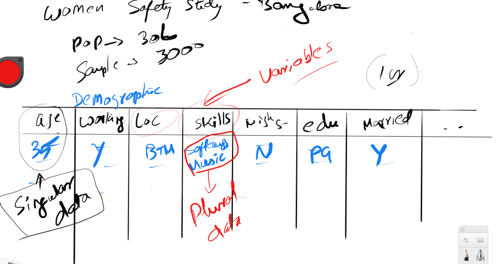
f
total poulation of bangalore = 1 cr
women population = 30 lakhs
30 lakhs 50 50 possibility
about 60 percent come under safety research
[Demographics of india wikipedia page](https://en.wikipedia.org/wiki/Demographics_of_India)

Age, Working?, Location, Working in night shift?, Skills, Education, Married?

Variables are the ones where we get answers for

What we collect here is 

35, y, BTM, Software Engineer|Music player, N, PG, Y

Single valued variables
Singular data
statistic (singular without s) is a summary of a sample

Sampling error
parameter - statistic

Skills plural data

Multivalues are hard to analyse

Singular data is easy to analyse

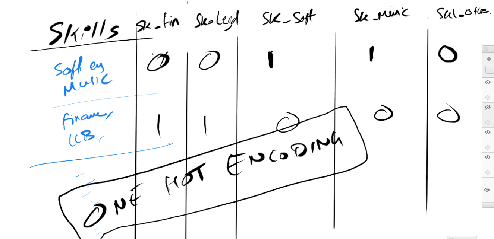

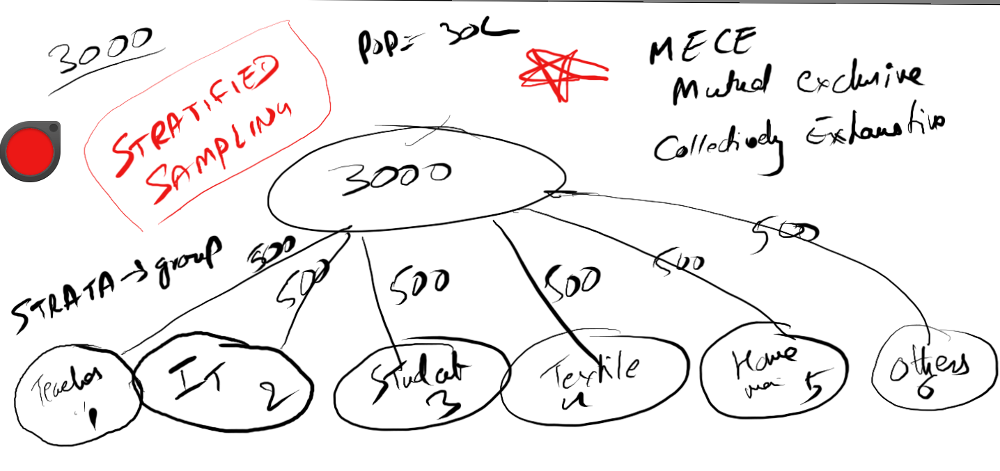
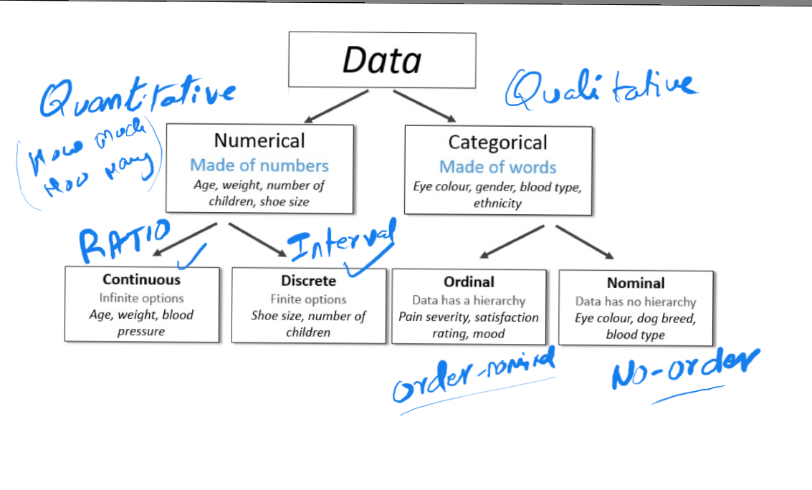
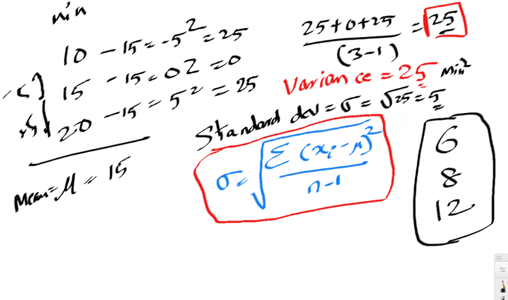
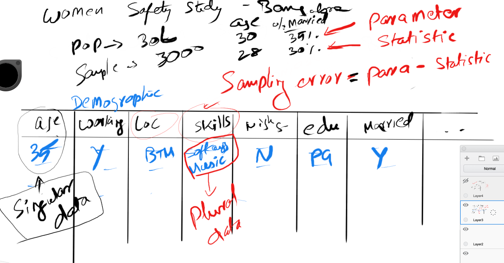
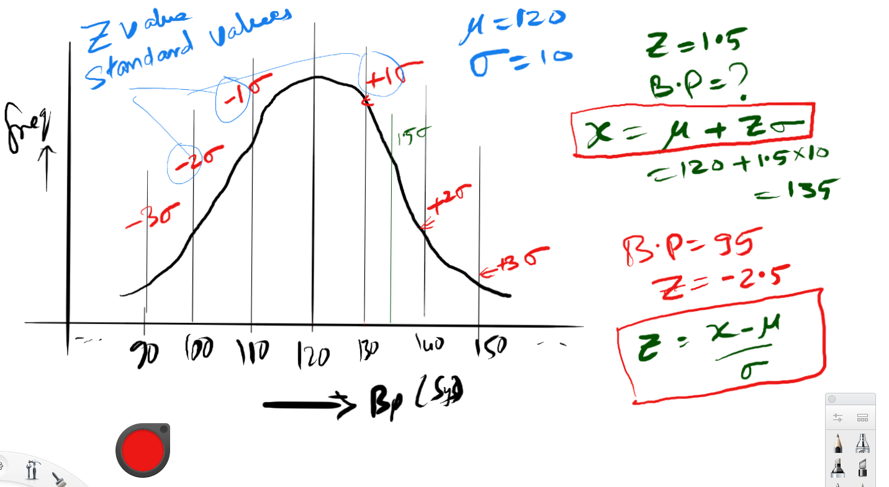
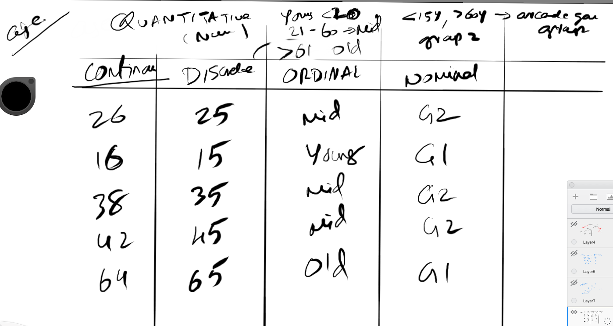
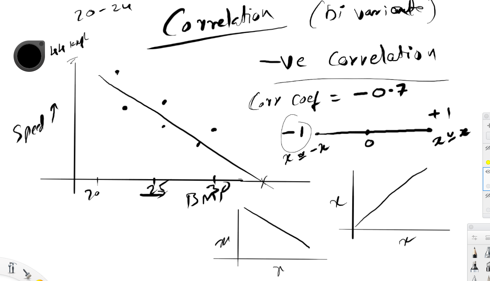
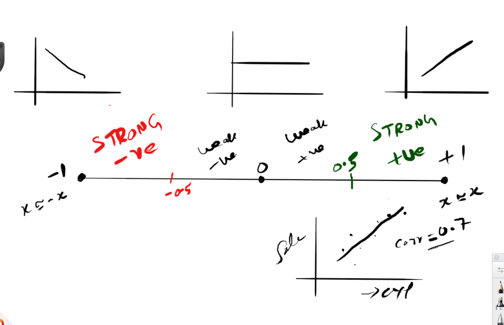
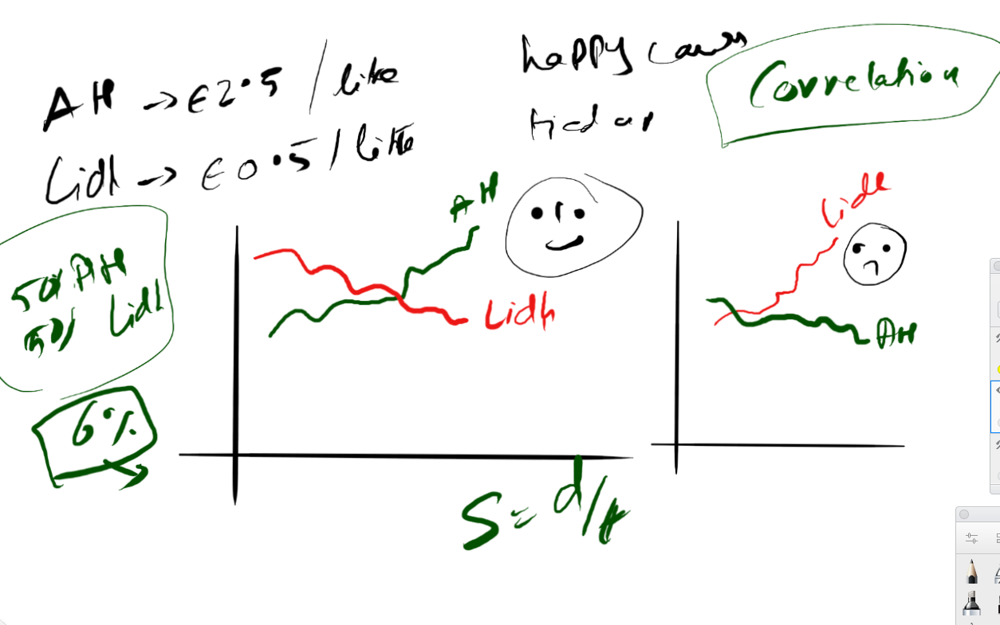
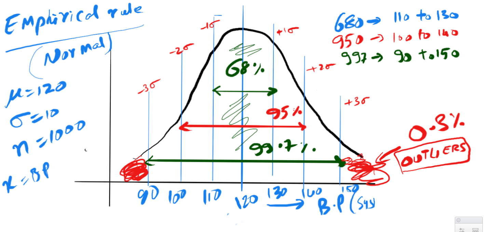
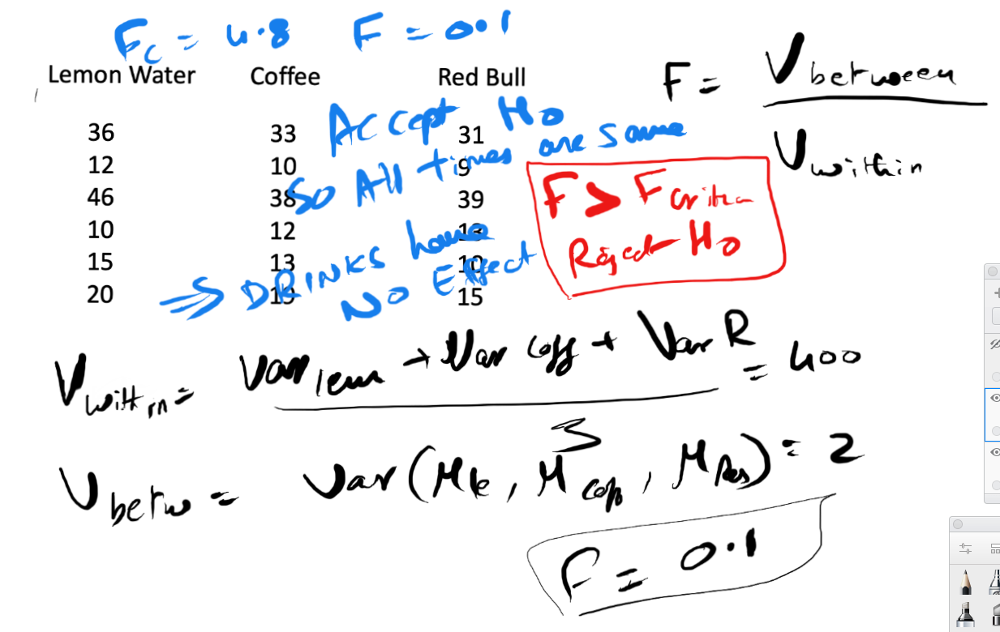
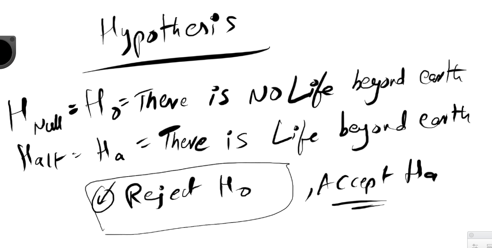
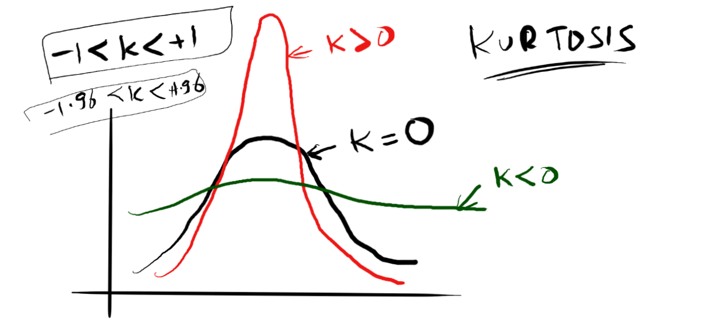
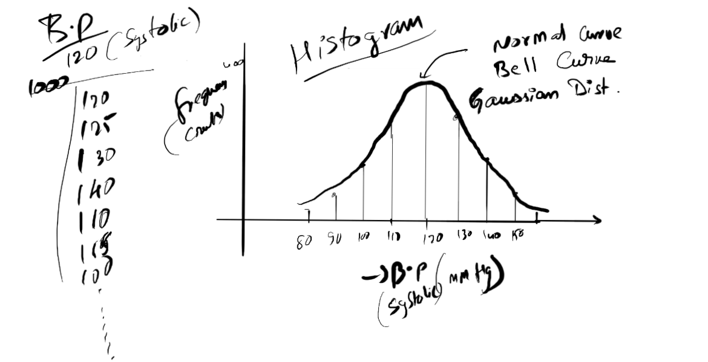
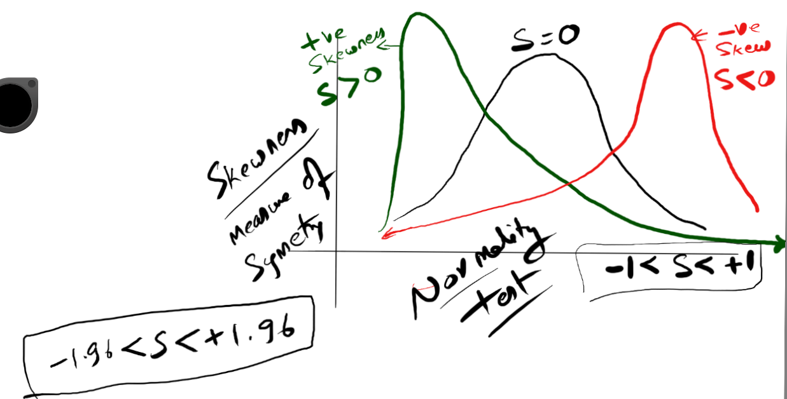

OneHotEncoding

Software Engineer| Musician
Finance | LLB
....

Skills can be converted to singular variable

Skills_Software_Engineer
Skills_Finance
Skills_Musician

one hot encoding

Converting a plural data into singular data

Skills_Software_Engineer 0
Skills_Finance 1
Skills_Musician 0

Variable is either 0 or 1

## Experiment

Pediasure

40 kids

20 pediasure 20 milk
Experiment

# Data 

## Numerical data
Made of numbers
### Continuous data
Age, weight, blood pressure, temperature
### Discrete data

## Categorical data
Eye colour, gender blood type, ethnicity
### Ordinal data
With order
### nominal data
BMW, Tata, battery is defective or not

Qualitative and quantitative data
Qualitative is called categorical data

Blood group is nominal by nature
This can be converted to ordinal by ordering it by
availability or rareness

by attaching some thing to it

dog breed nominal, arranged in order of height is ordinal

Amazon review, ordinal
Employee appraisal, categorical ordinal

Discrete data
Numerical
Shoe size
Predefined discrete data
Number of children

Step size in discrete data need not be same

## Continuous variable
same as Ratio data
## Discrete variable
Same as interval

Examples

length of time continuous
number of chocolates discrete
brand nominal
overall satisfaction rate ordinal
number of files discrete
ph level continuous
number of staples discrete

Age
continuous data

26, 25, 30, 40, 23, 60, 50
Discrete
Between range
Interval
0-10  5(mid value)
11-20 15
20-30 25
30-40 35

By taking mid values of the interval you can convert 
a continuous variable to a discrete variable

young, mid, old ordinal categories can be made from 
the discrete data
by defining a certian > or < operator

Can it be converted to nominal data

< 15 age and > 60 age play arcade games
mario pacman arcade games

Group1, Group2, Group3
These groups does not have any order
because both 15 year olds and 60 year olds are interested in playing
these games

losing information as we go right in that slide(review)

# Making sense of data
Harnessing data
Sampling
## With replacement
You put it back and take again
 
## Without replacement
Eg. lottery ticket
Third price winner cannot win the first price as well

10000 people survey on employee satisfaction
Random sample is the only valid
Non random invalid
## Simple random sample
Every employee equal probability of getting picked up
## Stratified sample
IT, Student, Textile, House wives, Teachers, Others
Principle of mutually exclusive and collectively exhaustive
Group should not overlap
All groups put together should cover the population
strata means group

70 80 % will use stratified sampling
achieving this can be default
Different channel for different strata

## Cluster sample
Sampling the strata itself
Read about this
As data scientists you may not encouter this kind of sampling

## Systematic
Perspective difference
people who has been there for long time(management decision is not good, strategy is not good)
people who are 5 months old (coffee machine is not working, work hours)

E0001
E0002
Employee number is sequential
Every 100th employee to surveyed

Working with organization systematic is good

## Biased Sampling
 Cultural diff Business survey done for PHD University of amsterdam
Tolerance - US less tolerant
Germany - 10 O clock meeting 5 minute early(9:55)
India - 15 minutes early India are yes people

10 managers from each region
china, india, uk, usa

convenient sampling(Biased sampling)
Doing the sampling of people who are university of amsterdam students

a small error can happen because of convenient sampling

This can be offset by using certain techniques

## Volunteer Sampling 
is not recommended
volunteers are usually affected. 
They have a strong bias towards a topic.

# Exploratory analysis
## EDA Exploratory data analysis

## Central tendency tendencies: Mean median and mode
### Mean
### Median
### Mode
